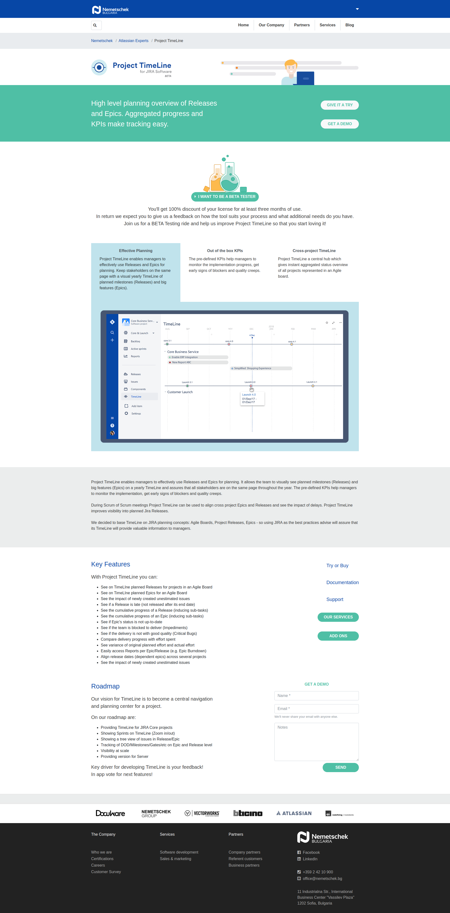

# Atlassian - Project Time Line Jira Addon Landing Page

[](./LICENSE)

## Overview

This GitHub project contains a simple HTML 5 landing page designed specifically for the Atlassian - Project Time Line Jira addon. The landing page serves as a dedicated platform to promote and provide information about the addon. It showcases the features, benefits, and functionality of the Project Time Line addon, offering users a glimpse into how it enhances project management and timeline visualization within Jira.

## Technologies Used

The landing page has been developed using the following technologies:

- HTML: The foundation of the page's structure and content is built using HTML, ensuring semantic markup and proper organization of elements.
- [Bootstrap 4](https://getbootstrap.com/): The popular front-end framework Bootstrap 4 has been utilized to enhance the page's responsiveness, ensuring optimal viewing experience across different devices and screen sizes.
- CSS3: CSS3 has been applied to style the landing page, allowing for customization of colors, typography, layout, and other visual aspects.
- JavaScript: JavaScript has been incorporated to add interactivity and dynamic behavior to the page, enabling smooth transitions, animations, and other engaging elements.
- [jQuery](https://jquery.com/): The jQuery library has been employed to simplify JavaScript programming tasks, providing convenient methods for DOM manipulation, event handling, and AJAX requests.
- [Font Awesome](https://fontawesome.com/): Font Awesome, a comprehensive icon toolkit, has been integrated to enhance the visual appeal of the landing page by incorporating stylish icons.

By leveraging these technologies, the Atlassian - Project Time Line Jira Addon landing page delivers a compelling and visually appealing user experience, capturing the essence of the event and effectively promoting its objectives.

## How To Install

1. Clone the Repository:
```
git clone [repository-url]
```
Replace `[repository-url]` with the URL of the GitHub repository.

2. Navigate to the Project Directory:
```
cd Atlassian-Project-Time-Line-Jira-Addon
```

3. Customize the Content:

Open the project files using a text editor or an integrated development environment (IDE) of your choice. Modify the HTML, CSS, and JavaScript files to customize the content, design, and functionality of the landing page according to your requirements.

4. Install Dependencies:

If you're using a package manager like npm or yarn, run the following command to install dependencies specified in the project:

```
npm install
```

or

```
yarn install
```

5. Launch the Landing Page:

Open the `index.html` file in a web browser to view the landing page locally. You can do this by either double-clicking the file or using a local development server.

That's it! 

You have now installed and set up the Atlassian - Project Time Line Jira Addon landing page project. You can start exploring and interacting with the landing page locally, making any necessary adjustments to meet your specific needs.

## Screenshots



---

## License

This project is licensed under the MIT License.
